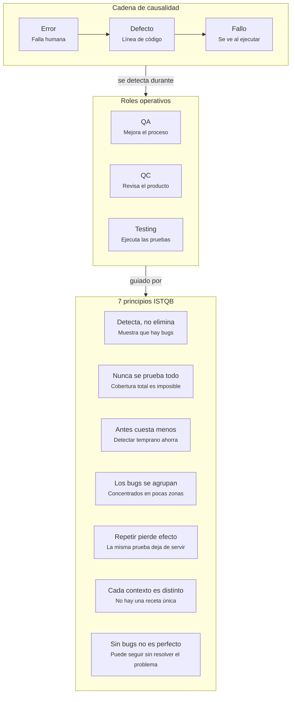

# Casos de Prueba de Caja Negra — presupuesto_analisis.py

## Mapa Conceptual

**Notas del equipo:**
- Error → Defecto → Fallo: el error es la equivocación humana, el defecto es la línea física incorrecta, el fallo es lo que se observa al ejecutar.
- QA es preventivo (mejora el proceso), QC es correctivo (inspecciona el producto), Testing es la actividad concreta dentro de QC.
- Los 7 principios ISTQB guían cómo se diseña y ejecuta el testing.

---

## Tabla de Casos de Prueba

| ID | Descripción | Precondición | Entrada | Esperado | Real | Estado |
|----|---|---|---|---|---|---|
| CP-01 | Comportamiento sin socios | Sistema iniciado, presupuesto > 0 | presupuesto=10000, socios=0, meses=12 | Mensaje controlado de error, sin cerrar el programa | `ZeroDivisionError` en la línea `cuota_por_socio = total / socios` — el programa se detiene | Failed |
| CP-02 | Comportamiento con número negativo de socios | Sistema iniciado, presupuesto > 0 | presupuesto=10000, socios=-2, meses=12 | Mensaje controlado de error, sin cerrar el programa | Calcula una cuota por socio negativa, sin ninguna advertencia | Failed |
| CP-03 | Comportamiento con plazo de inversión extremo | Sistema iniciado, presupuesto > 0, socios > 0 | presupuesto=10000, socios=4, meses=100 | Cálculo correcto o mensaje de advertencia por valor fuera de rango razonable | Calcula un interés desproporcionado ($2,000,000.00) sin ninguna advertencia | Failed |

---

## Reportes de Defecto

**CP-01** → El Fallo ocurre porque el Defecto está en la línea `cuota_por_socio = total / socios`: el código nunca valida que `socios` sea distinto de cero antes de dividir.

**CP-02** → El Fallo ocurre porque no existe ninguna validación de que `socios` sea un número positivo. El programa acepta valores negativos y produce un resultado financiero sin sentido de forma silenciosa (no lanza excepción).

**CP-03** → El Fallo ocurre porque no hay validación de límite superior para `meses`. El término `meses ** 2` crece cuadráticamente sin ningún techo, generando intereses desproporcionados sin advertencia alguna.

---

## Nota metodológica

Los tres defectos representan dos tipos distintos de fallo:

- **Fallo explícito** (CP-01): el programa se detiene con un `Traceback` visible.
- **Fallo silencioso** (CP-02 y CP-03): el programa entrega un resultado, pero ese resultado es incorrecto o carece de sentido — mucho más difícil de detectar sin un plan de pruebas deliberado.
