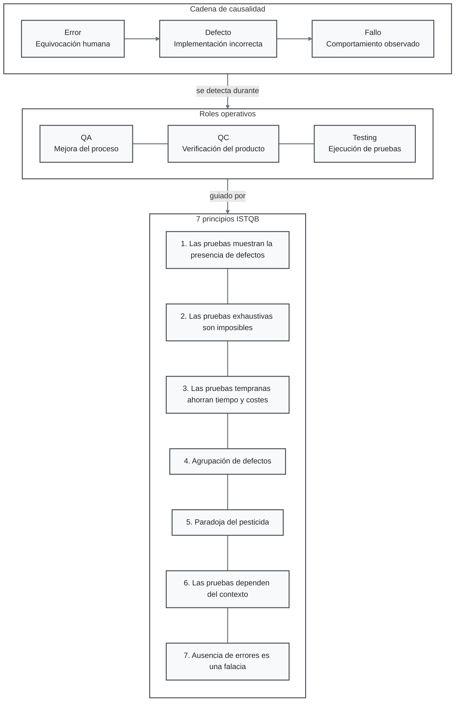

# Casos de Prueba de Caja Negra — `presupuesto_analisis.py`

## 1. Mapa Conceptual



### Notas del equipo

* **Error → Defecto → Fallo:** el error corresponde a una equivocación humana; el defecto es la implementación incorrecta introducida en el código; y el fallo es el comportamiento observable durante la ejecución.
* **QA:** enfoque preventivo orientado a la mejora y aseguramiento de los procesos.
* **QC:** enfoque orientado a la verificación y control de la calidad del producto.
* **Testing:** actividad destinada a ejecutar pruebas para identificar defectos y evaluar el comportamiento del software.
* Los **7 principios de testing del ISTQB** sirven como fundamentos para diseñar, ejecutar y evaluar las pruebas de software.

---

## 2. Tabla de Casos de Prueba

| ID        | Descripción                                   | Precondición                                                   | Entrada                                          | Resultado esperado                                                                                                             | Resultado real                                                                                   | Estado     |
| --------- | --------------------------------------------- | -------------------------------------------------------------- | ------------------------------------------------ | ------------------------------------------------------------------------------------------------------------------------------ | ------------------------------------------------------------------------------------------------ | ---------- |
| **CP-01** | Comportamiento con cero socios                | Sistema iniciado y presupuesto mayor que 0                     | `presupuesto=10000`<br>`socios=0`<br>`meses=12`  | Mostrar un mensaje controlado indicando que el número de socios debe ser mayor que cero, sin detener abruptamente el programa. | Se produce `ZeroDivisionError` en `cuota_por_socio = total / socios` y el programa se detiene.   | **Failed** |
| **CP-02** | Comportamiento con número negativo de socios  | Sistema iniciado y presupuesto mayor que 0                     | `presupuesto=10000`<br>`socios=-2`<br>`meses=12` | Rechazar el valor e indicar que el número de socios debe ser positivo.                                                         | Se calcula una cuota por socio negativa sin mostrar ninguna advertencia o mensaje de validación. | **Failed** |
| **CP-03** | Comportamiento con plazo de inversión extremo | Sistema iniciado, presupuesto mayor que 0 y socios mayor que 0 | `presupuesto=10000`<br>`socios=4`<br>`meses=100` | Calcular el valor correctamente o mostrar una advertencia cuando el plazo se encuentre fuera del rango esperado.               | Se genera un interés desproporcionado de **$2,000,000.00** sin ninguna advertencia.              | **Failed** |

---

## 3. Reportes de Defecto

### DEF-01 — División entre cero

**Caso relacionado:** CP-01

El fallo ocurre porque el programa intenta calcular la cuota por socio mediante:

```python
cuota_por_socio = total / socios
```

No existe una validación previa que compruebe que `socios` sea diferente de cero.

**Resultado:** se genera una excepción `ZeroDivisionError` y la ejecución del programa se interrumpe.

**Causa:** ausencia de validación del límite inferior de `socios`.

---

### DEF-02 — Aceptación de socios negativos

**Caso relacionado:** CP-02

El programa no valida que el número de socios sea un valor positivo.

Como consecuencia, acepta `socios=-2` y realiza operaciones matemáticas con dicho valor, generando una cuota negativa.

**Resultado:** se obtiene un resultado financiero sin sentido sin generar ningún mensaje de validación.

**Causa:** ausencia de una condición que restrinja `socios` a valores mayores que cero.

---

### DEF-03 — Ausencia de límite para el plazo

**Caso relacionado:** CP-03

El cálculo utiliza el término:

```python
meses ** 2
```

Sin establecer un límite superior para el valor de `meses`.

Al proporcionar un plazo extremo, el crecimiento cuadrático genera un resultado financiero desproporcionado sin advertencia.

**Resultado:** se obtiene un interés de **$2,000,000.00** para `meses=100`.

**Causa:** ausencia de validación del rango máximo permitido para `meses`.

---

## 4. Clasificación de los Fallos

Los casos de prueba identificados permiten distinguir entre dos tipos principales de comportamiento incorrecto:

### Fallo explícito

**CP-01**

El programa se detiene durante la ejecución y presenta una excepción `ZeroDivisionError`.

Este tipo de fallo es relativamente fácil de identificar porque existe una evidencia directa del error durante la ejecución.

### Fallo silencioso

**CP-02 y CP-03**

El programa continúa ejecutándose y devuelve un resultado, pero este resultado es incorrecto, inválido o carece de sentido para el contexto financiero.

Este tipo de fallo puede ser más difícil de detectar, ya que la ejecución aparentemente termina correctamente.

---

## 5. Conclusiones

Las pruebas de caja negra permitieron identificar defectos relacionados principalmente con la **validación de entradas** y el **control de valores fuera de rango**.

Los resultados muestran que:

1. El sistema no controla adecuadamente valores límite como `socios=0`.
2. El sistema permite valores inválidos, como un número negativo de socios.
3. El sistema no establece límites para valores extremos de `meses`.
4. Existen tanto fallos explícitos como fallos silenciosos.
5. Las pruebas de caja negra permiten identificar estos comportamientos sin necesidad de modificar la implementación del programa.

Estos resultados evidencian la importancia de incorporar validaciones de entrada y casos límite dentro del proceso de pruebas de software.
